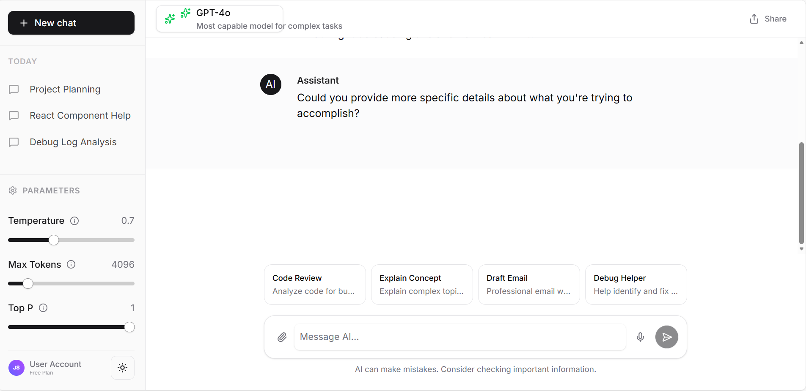
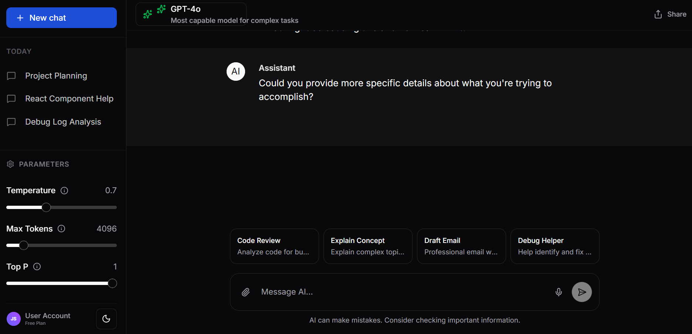

# AI Interface Frontend Assessment

A polished, frontend-only prototype of an AI chat interface built with React, TypeScript, and Tailwind CSS.

## Research

### Platforms Reviewed
1.  **ChatGPT**: Clean, minimalist interface with a focus on the conversation. Standout feature: The sidebar for conversation history is very intuitive.
2.  **Claude**: Excellent use of "Artifacts" for code and documents. Standout feature: The clean typography and distinct separation between user and AI messages.
3.  **Google Gemini**: Integration with other Google services is seamless. Standout feature: The ability to modify response length and tone directly.

### Features Chosen for Implementation
1.  **Model Selector**: A dropdown to switch between different AI models (GPT-4, Claude 3, etc.).
2.  **Prompt Editor**: A rich textarea with support for templates and file attachment icons.
3.  **Control Panel**: Sliders to adjust Temperature, Max Tokens, and Top P.
4.  **Chat Interface**: A responsive chat area with markdown support, code syntax highlighting, and copy functionality.
5.  **Theme Toggle**: Seamless switching between Light and Dark modes.
6.  **Streaming Effect**: Simulated typing animation for AI responses.

## Design

### Design Decisions
-   **Color Palette**:
    -   **Light Mode**: `bg-background` (white/off-white) for cleanliness, `text-foreground` (dark gray) for readability.
    -   **Dark Mode**: `bg-background` (deep gray/black) to reduce eye strain, `text-foreground` (light gray) for contrast.
    -   **Accent**: Used a primary color (blue/indigo) for active states and buttons.
-   **Typography**: Used `Inter` (via standard sans stack) for a modern, clean, and legible look.
-   **Spacing**: Consistent use of Tailwind's spacing scale (`p-4`, `m-4`, `gap-4`) to ensure rhythm and balance.
-   **Layout**:
    -   **Desktop**: Fixed sidebar for navigation/settings, central chat area.
    -   **Mobile**: Collapsible sidebar (Sheet) triggered by a hamburger menu.

### Tailwind Token Mapping
-   **Sidebar**: `bg-sidebar text-sidebar-foreground border-r border-sidebar-border`
-   **Chat Message (User)**: `bg-background`
-   **Chat Message (AI)**: `bg-muted/30`
-   **Input Area**: `bg-background border border-input rounded-xl shadow-sm`

### Design & Screenshots
#### Desktop (Light Mode)


#### Desktop (Dark Mode)



## Development

### Tech Stack
-   **Framework**: React 19 (via Vite)
-   **Language**: TypeScript (Strict Mode)
-   **Styling**: Tailwind CSS 4
-   **Icons**: Lucide React
-   **Animations**: Tailwind CSS Animate
-   **Markdown**: `react-markdown`, `remark-gfm`
-   **Syntax Highlighting**: `react-syntax-highlighter`
-   **Routing**: `wouter` (lightweight router)

### Implementation Notes
-   **State Management**: Used React `useState` and `useEffect` for local state. `useChat` hook manages the message flow and mock streaming.
-   **Mock API Setup**: `client/src/lib/data.ts` serves as the mock database, providing static data for models and templates to simulate backend responses without a real server.
-   **Theming**: Custom `ThemeProvider` handles light/dark mode persistence and class switching.
-   **Components**: Built reusable UI components (Button, Slider, Select) using `radix-ui` primitives for accessibility.

### Known Limitations
-   **No Real Backend**: The AI responses are simulated (mocked) and do not call an actual API.
-   **Local Storage**: Chat history is not persisted across sessions in this prototype (though the structure supports it).

## Getting Started

### Prerequisites
-   Node.js 18+
-   npm or yarn

### Installation
```bash
git clone <repository-url>
cd AI-Interface-Frontend
npm install
```

### Development
```bash
npm run dev
```
Open http://localhost:5173

### Storybook
Storybook is a frontend workshop for building UI components and pages in isolation. It allows you to develop and test components without worrying about app-specific dependencies or context.

To start Storybook:
```bash
npm run storybook
```
Open http://localhost:6006

You can view and interact with the components (Button, Slider, ChatBubble, etc.) in the sidebar. This helps in:
- Visualizing components in different states (hover, active, disabled).
- Testing responsiveness and themes (light/dark mode).
- Ensuring consistency across the design system.

### Build
```bash
npm run build
```

## Project Structure
```
/client
  /src
    /components   # UI components (ChatArea, Sidebar, etc.)
    /hooks        # Custom hooks (useChat, useTheme)
    /lib          # Utilities and mock data
    /pages        # Route components
    /stories      # Storybook stories
    /types        # TypeScript interfaces
```
